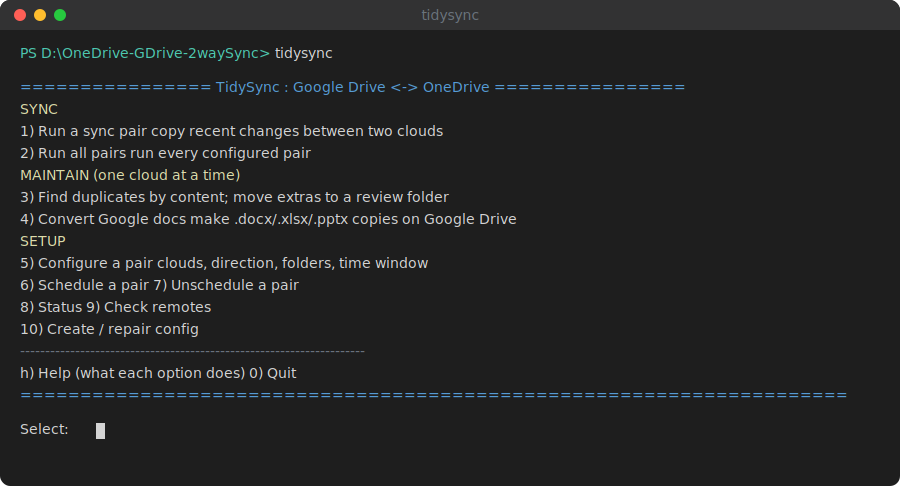
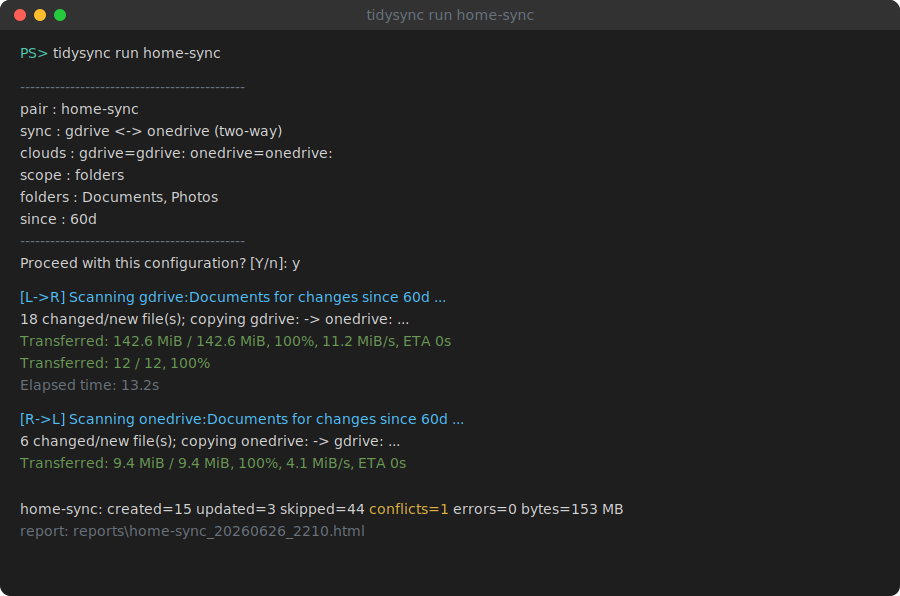
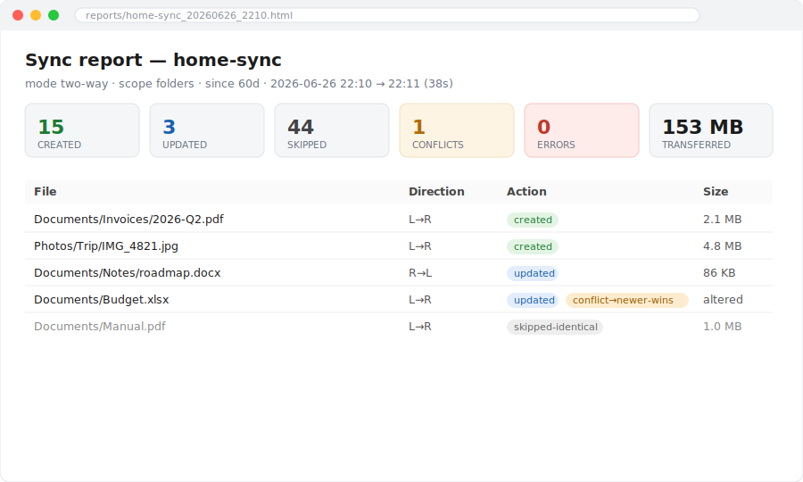

# Google Drive ⇄ OneDrive TidySync

> Private, free, two-way **delta sync** + **content-hash duplicate detection** for **any two
> cloud storages** — built on [rclone](https://rclone.org/)'s 70+ backends, driven by a single
> menu-based command (`tidysync`). **Tested on Google Drive ⇄ OneDrive.**

[](https://github.com/jaimalleshk/Google-Drive-OneDrive-TidySync/actions/workflows/ci.yml)
[](https://github.com/jaimalleshk/Google-Drive-OneDrive-TidySync/releases)
[](LICENSE)

## ✨ What makes TidySync unique

Most tools do *one* of these. TidySync combines them — **privately and for free** (your files
move cloud ↔ cloud directly via your own OAuth; nothing transits a third-party server):

| # | Feature | Why it's different |
|---|---------|--------------------|
| 1 | **Content-hash duplicate detection + quarantine** *(headline)* | Finds files with **identical content under any name, in any folder**, keeps the newest, moves the rest to `_duplicates/` for review. rclone's own `dedupe` only catches same-*name* files on Google Drive; MultCloud/cloudHQ don't do content dedupe at all. |
| 2 | **Safe-by-default delta sync** | Only what changed since last run, **newest-wins**, **never deletes**, refuses an accidental full-drive copy. No rclone flags to learn. |
| 3 | **Convert all Google Workspace files to Microsoft Office format** | Converts native Google Docs/Sheets/Slides to `.docx/.xlsx/.pptx` — on demand (recursive, in place, only where missing) or automatically during sync — so OneDrive gets **editable Office files** instead of useless link stubs. |
| 4 | **Per-run reports** (HTML + CSV + JSON) | Exactly what changed, what's duplicated, and reclaimable space. Neither raw rclone nor RcloneView produce these. |
| 5 | **One menu-driven command + config wizard** | Approachable for non-technical users, fully scriptable & schedulable for power users — with live progress (ETA, files done/pending). |
| 6 | **Private & free** | Direct cloud ↔ cloud via *your own* OAuth tokens. No third-party server, no metering, no subscription. |

> TidySync is an *opinionated layer on top of [rclone](https://rclone.org/)*: the sync engine is
> rclone's; the **duplicate detection, Office conversion, reporting, safety defaults and UX are
> what TidySync adds**.

## What it does

A small, opinionated CLI that syncs **deltas** (newly created + recently modified files
and folders) between two clouds — one-way in either direction, or two-way, on demand or on a
schedule — and writes a report of exactly what was synced.

It talks directly to each provider's API using **your own** OAuth credentials. Files move
**cloud ↔ cloud directly** — they do not pass through any third-party server. (Hosted
alternatives like MultCloud / cloudHQ do the same job but are metered/paid and route your data
through their infrastructure.)

### 🌐 Works with any rclone remote

Because the engine is rclone, TidySync works between **any two of rclone's 70+ backends** —
Dropbox, Box, S3, pCloud, SFTP, and more — not just Google Drive and OneDrive. You add remotes
with `rclone config` and reference them in `config.yaml`. Two honest caveats:

- **Only Google Drive ⇄ OneDrive is tested so far.** Other pairs *should* work (the sync logic
  is backend-agnostic) but are unvalidated — try them with `--dry-run` first and report back.
- **Two features are conditional:** the **Google-docs → Office conversion** applies only when a
  source is Google Drive; **content-hash dedupe** needs the backend to expose a content hash
  (most do — md5/sha1/etc.).

> ### 🔬 Status — validation in progress
> The logic is covered by **offline tests** (sync, dedupe, and the config wizard, with rclone
> stubbed), and it has now been **exercised against live Google Drive / OneDrive accounts** —
> authentication, listing, and dry-run sync are verified. Broader end-to-end validation (more
> folders, real transfers, conflict cases) is **in progress**. Treat it as **pre-release**: try
> it on non-critical folders and use `--dry-run` first. Feedback and test reports are welcome.

## How the delta model works

This tool deliberately does **not** use `rclone bisync`. Instead each direction runs:

```
rclone copy SRC DST --max-age <window> --update
```

- `--max-age <window>` — only consider files modified/created **since** your chosen point
  (a date, a duration, or the remembered last-sync time). No full-drive scan.
- `--update` — never overwrite a newer file with an older one ⇒ **most-recently-modified wins**.
- Identical files (same size/hash/modtime) are skipped automatically ⇒ no needless copies.
- **Two-way** = the same copy run in both directions.
- **Deletions are never propagated** — by design this tool only handles created + modified files.

A file changed on *both* sides within the window is flagged in the report as a
**conflict (resolved newest-wins)** so nothing happens silently.

## Setup

**Step 1 (required either way): install rclone and authorise your clouds.**

```bash
winget install Rclone.Rclone   # or: https://rclone.org/downloads/
rclone config                  # create a Google Drive remote ("gdrive") and a OneDrive remote ("onedrive")
```

> Tip: for best Google Drive performance, create your own Google API client ID during
> `rclone config` (rclone documents this).

**Step 2: choose how to run TidySync — Option A or Option B.**

### Option A — Run with Python  *(simplest if you have Python 3.9+)*

```bash
pip install -e .          # gives you the `tidysync` command (or use: python -m tidysync)
tidysync init             # writes config.yaml; edit it to map remotes + define pairs
tidysync check            # verify both clouds are reachable
tidysync                  # open the menu
```

### Option B — Standalone executable  *(no Python needed to run)*

Build a single `tidysync.exe` you can run yourself or hand to someone who has no Python:

```bash
pip install -r requirements.txt pyinstaller   # build-time only
build_exe.bat                                  # Windows -> tidysync.exe in this folder
```

> Maintainers: `publish_exe.bat` rebuilds **and** auto-refreshes the committed `tidysync.exe`
> (commit + push) and updates the latest GitHub Release asset. Use plain `build_exe.bat` for a
> build-only run.

macOS/Linux build (PyInstaller **can't cross-compile** — build on the OS you'll run on):

```bash
pyinstaller --onefile --console --name tidysync \
  --paths src --collect-submodules tidysync \
  --distpath . --workpath build/pyi --specpath build app.py
```

Then use it exactly like the command above — e.g. `tidysync.exe init`, `tidysync.exe check`,
or double-click it for the menu. (The exe bundles Python + TidySync, **not rclone** — rclone
must still be installed.)

### Option C — Download the prebuilt executable  *(nothing to install but rclone)*

Grab `tidysync.exe` from the
[**Releases page**](https://github.com/jaimalleshk/Google-Drive-OneDrive-TidySync/releases)
(a copy also lives in the repo root). Install rclone, run `rclone config`, then run `tidysync.exe`.

> The exe is **unsigned**, so Windows SmartScreen may warn on first launch — choose
> *More info → Run anyway*, or build it yourself (Option B) if you prefer.

## Usage

### One entry point — the menu

There is a **single command**, `tidysync`. Run it with no arguments (or double-click
`start.bat` on Windows) to open an interactive menu — you never run individual `.py` files:

```
================ TidySync : Google Drive <-> OneDrive ================
  SYNC
    1) Run a sync pair        copy recent changes between two clouds
    2) Run all pairs          run every configured pair
  MAINTAIN  (one cloud at a time)
    3) Find duplicates        by content; move extras to a review folder
    4) Convert Google docs    make .docx/.xlsx/.pptx copies on Google Drive
  SETUP
    5) Configure a pair       clouds, direction, folders, time window
    6) Schedule a pair        7) Unschedule a pair
    8) Status                 9) Check remotes
   10) Create / repair config
  ---------------------------------------------------------------------
    h) Help (what each option does)                 0) Quit
=====================================================================
```

### Interactive confirmation & config completion

When **you** run a sync from a terminal, the tool reads the config, shows you the pair
(source, target, mode, scope, folders, delta start), and asks you to confirm. If anything is
**missing or invalid**, it prompts you for it and **writes your answers back to `config.yaml`** —
so you can either hand-edit the YAML or let the wizard build it. You can also run the wizard
directly: `tidysync configure`.

When the **scheduler** runs it (no terminal, and it passes `--yes`), it skips all prompts and
runs straight from the config.

### Command-line (for scripts and the scheduler)

```bash
# On-demand
tidysync run projects --since 2026-06-01     # first run needs an explicit start point
tidysync run projects                        # later runs resume from last-sync automatically
tidysync run projects --dry-run              # report only, transfer nothing
tidysync run projects --yes                  # skip the confirmation prompt
tidysync run-all                             # every pair

# Status & reports
tidysync status                              # last-sync time + latest report per pair
# reports are written to ./reports/<pair>_<timestamp>.{html,csv,json}

# Scheduling (Windows Task Scheduler)
tidysync schedule projects --every 30m       # every 30 minutes
tidysync schedule projects --daily 02:00     # daily at 02:00
tidysync unschedule projects
```

On Linux/macOS, schedule with cron instead, e.g.:
`*/30 * * * * tidysync --config /path/config.yaml run projects`

## Google Workspace docs → Office (`convert`)

Native Google docs (Docs/Sheets/Slides/Drawings) have **no downloadable bytes** — a plain sync
turns them into useless link/shortcut files on OneDrive. TidySync fixes this: before syncing, it
**exports each native doc to its Office equivalent and writes that real file into the same Google
Drive folder**, so the sync then copies a usable file to OneDrive.

| Google type | becomes |
|-------------|---------|
| Docs        | `.docx` |
| Sheets      | `.xlsx` |
| Slides      | `.pptx` |
| Drawings    | `.svg`  |

- **On by default** for every pair (`convert_google_docs: true`); runs automatically as a pre-step
  of any sync where the source is a Google Drive remote.
- **Idempotent** — a doc is re-converted only when its Office twin is missing or older than the doc,
  so repeated syncs don't churn.
- The original native doc stays in Drive; the new Office file sits **alongside it in the same
  folder** (this is the default you chose). Both clouds end up with a real, editable Office file.
- Run it standalone too:

```bash
tidysync convert gdrive            # report only: what would be converted
tidysync convert gdrive --apply    # create the Office files on Drive
tidysync convert gdrive --folder "Projects" --apply
```

> Notes: conversion uses rclone's `--drive-export-formats`. Don't configure an rclone
> *import* format on the Drive remote, or the uploaded `.docx` would turn back into a Google Doc.
> Forms/Sites and other types without an Office equivalent are reported as unsupported and skipped.
> ⚠️ This path is still being validated against live accounts (see Status above).

## Screenshots

> Illustrative mockups with sample (non-personal) data — the real output is the same.

**One entry point — the menu** (`tidysync` with no arguments, or double-click `tidysync.exe`):



**A two-way sync run** — confirmation, live scan spinner, rclone's progress (%, speed, ETA,
files), and a final summary with a link to the report:



**The per-run report** (HTML, plus CSV + JSON) — totals at a glance and a per-file table with
direction, action, and conflict flags:



_A full step-by-step user guide with real (blurred) screenshots will follow once live testing
against personal accounts is complete._

## Configuration

See [`config.example.yaml`](config.example.yaml). Per pair:

| key      | values                                             |
|----------|----------------------------------------------------|
| `mode`   | `left-to-right`, `right-to-left`, `two-way`        |
| `scope`  | `whole-drive`, or `folders` + a `folders:` list    |
| `delta.since` | `last-sync`, a date (`2026-06-01`), or a duration (`720h`) |
| `filters`| optional rclone filter rules (e.g. `- *.tmp`)      |
| `dry_run`| `true`/`false`                                     |

## Duplicate detection (`dedupe`)

Finds **content-duplicate files within a single cloud** and quarantines the extras for you to
review and delete. This is the feature that sets the tool apart from plain rclone: rclone's
built-in `dedupe` only handles same-*name* files on Google Drive, whereas this finds files with
**identical content under any name, in any folder**.

Design decisions baked in:

- **By content hash only**, never by filename — the same filename in different folders can hold
  different content, so name-matching would be unsafe.
- **Per cloud only** — hashes can't be compared across providers (Google Drive uses MD5, OneDrive
  SHA1/quickXorHash), and a copy existing on *both* clouds is expected (that's the sync), not a duplicate.
- **Files only**, never folders.
- **Keeps the newest-modified** copy in each group; moves the rest to a quarantine folder.
- **Report-only by default.** Nothing is moved without `--apply`, and nothing is ever auto-deleted.

```bash
tidysync dedupe gdrive                       # report only: list duplicate groups on Google Drive
tidysync dedupe gdrive --folder "Projects"   # limit scan to a folder (repeatable)
tidysync dedupe gdrive --apply               # move older duplicates into _duplicates/ for review
tidysync dedupe onedrive --apply             # run per cloud
```

Quarantined files keep their original relative path under `_duplicates/`, so you can see where each
came from. Review that folder, then delete what you don't want. The sync engine **always excludes
`_duplicates/`**, so quarantined files are never propagated to the other cloud.

> Caveat: dedupe is per-cloud. If a duplicate path *also* exists on the other cloud, a later
> two-way sync could copy it back. Recommended flow: run dedupe, review, **delete** from quarantine,
> and dedupe each cloud as needed.

## Reports

Every run writes three files to `reports/`:

- **`.html`** — summary cards (created / updated / skipped / conflicts / errors / bytes) and a
  per-file table with direction, action, size and modified time.
- **`.csv`** — the same rows for spreadsheets.
- **`.json`** — full machine-readable run record.

Dedupe runs write a parallel `dedupe_<remote>_<timestamp>.{html,csv,json}` showing each duplicate
group with the kept vs quarantined copies, hashes, sizes and reclaimable space.

## Troubleshooting

**Google Drive `Error 403: rateLimitExceeded` / "Quota exceeded ... Queries per minute".**
A large scan (especially `whole-drive`) fires too many Drive API calls per minute. Add throttling
flags via a pair's `rclone_args` (see [`config.example.yaml`](config.example.yaml)):

```yaml
    rclone_args:
      - --tpslimit
      - "10"            # cap API calls/sec
      - --drive-pacer-min-sleep
      - 200ms
      - --checkers
      - "4"
      - --transfers
      - "2"
      - --fast-list     # list big trees in far fewer API calls
```

Also prefer **`scope: folders`** over `whole-drive`, and keep a reasonable `delta.since` window —
both dramatically cut the number of API calls. Nothing is harmed when this error occurs; just re-run.

## Safety notes

- The first run of a `last-sync` pair refuses to proceed without an explicit `--since`,
  to prevent an accidental whole-drive copy.
- `--dry-run` is supported end-to-end.
- Use `filters` to exclude temp/lock files (`~$*`, `*.tmp`, etc.).
- Two-way sync compares between runs, not in real time — avoid editing the same file on both
  sides simultaneously; shorter schedules reduce the conflict window.

## Feedback & contributing

Questions, ideas, and bug reports are very welcome — **no email needed**:

- 🐛 **Bugs / feature requests:** open an [issue](https://github.com/jaimalleshk/Google-Drive-OneDrive-TidySync/issues).
- 💬 **Questions / ideas / "it worked!" reports:** start a [discussion](https://github.com/jaimalleshk/Google-Drive-OneDrive-TidySync/discussions).
- 🤝 **Pull requests:** see [CONTRIBUTING.md](CONTRIBUTING.md).

Since it's pre-release, **real-world test reports** (what worked, what didn't, on which OS/accounts)
are especially valuable.

## License

MIT.
